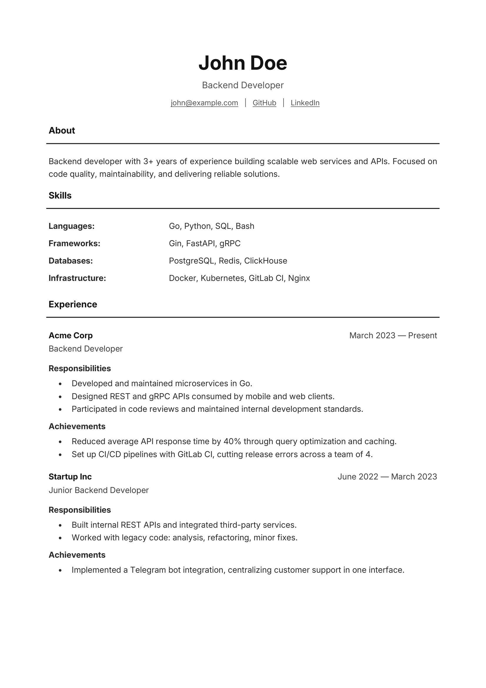

# resume-gen

A command-line tool that generates a PDF resume from a JSON file.

## Overview

resume-gen reads a JSON file with resume content and produces a formatted PDF.



## Installation

```bash
go install github.com/yognevoy/resume-gen@latest
```

## Usage

```bash
resume-gen [flags]
```

## Flags

| Flag | Default       | Description          |
|------|---------------|----------------------|
| `-i` | `resume.json` | Input JSON file path |
| `-o` | `resume.pdf`  | Output PDF file path |

## How to Contribute

If you find a bug or have a feature request, please check the [Issues page](https://github.com/yognevoy/resume-gen/issues)
before creating a new one. For code contributions, fork the repository, make your changes on a new branch, and submit a
pull request with a clear description of the changes. Please make sure to test your changes thoroughly before
submitting.

## License

This project is licensed under the MIT License - see
the [LICENSE.txt](https://github.com/yognevoy/resume-gen/blob/main/LICENSE.txt) file for details.
